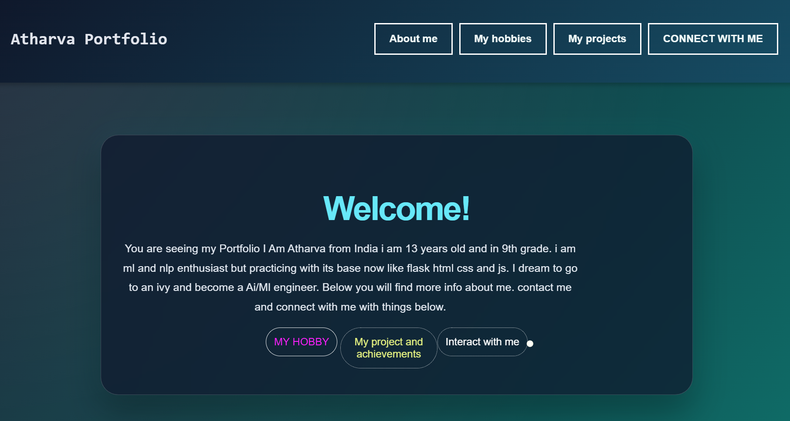

#My Portfolio
This site is my protfolio and some info about me i learnt some css in depth and proper debug sessions. I also learnt special js effects in it.
#Brief
This project is designed for introd=ucing me and my 2 projects .It tells you how to contact to me and my hobbies.

## TECH STACK AND GOALS
I used html css and little bit of js.
I used ai in this project for 3 to 4 css style fixes and a little bit of debug for index.html.
i Goal to fill this with project images and other prides of me.
## WHAT IS INSIDE-
-a cool cursor  effect to browse with.
-A brief of mine
-My hobbies 
-How to contact me
-SOME OF MY PROJECTS "2 BTW!"

#IF YOU WANT TO RUN IT:)
DOWNLOAD THE FILES. 
OPEN INDEX.HTML
THAT IS IT
[ PLS. DONT JUDGE I AM A BEGGINER]
